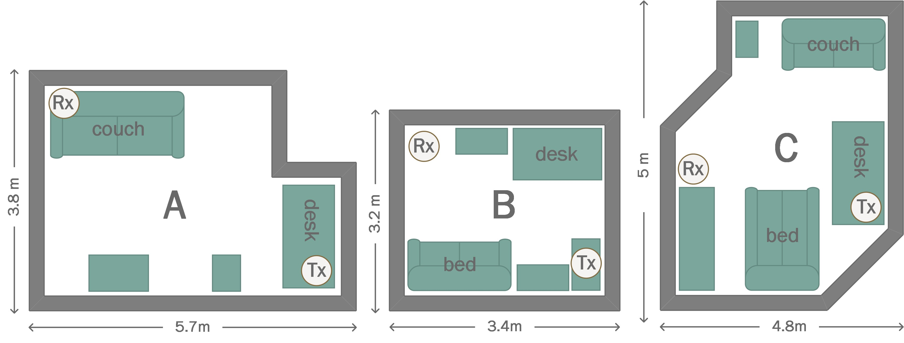

# One-Class Support Vector Machine for WiFi-based Device-free Indoor Presence Detection 

## 0. What is it about?

The utilization of existing radio signals such as IEEE 802.11 (WiFi) for device-free detection of human presence and 
movement indoors has garnered significant interest among researchers in academia and industry. Improving the efficiency 
of buildings, particularly in terms of heating and energy costs, relies on accurately detecting room occupancy. 
Our approach uses channel state information (CSI) obtained from commodity 802.11ac hardware as input to machine 
learning based on one-class support vector machine. Unlike other methods that necessitate extensive learning in 
environments with and without human presence, our approach treats human presence as a novelty. This simplifies 
the training process, as we only need to learn from environments without human presence, specifically empty rooms. 
Furthermore, since we focus solely on analyzing the magnitude information of the CSI data, there is no requirement for 
intricate sanitization of the phase information.

The full paper describing all details of the proposed indoor presence detection scheme can be found here:
[full paper](https://www2.informatik.hu-berlin.de/~zubow/pd_ocsvm_ew_2023.pdf "Reviewer version")

## 1. Installation

We tested our implementation with Ubuntu as well as Mac OS.

Clone our repository:
```
$ git clone https://github.com/zubow/ocsvm_pd.git
```

Install all required packages:
```
$ pip install -r requirements.txt
```

Next step is to download the CSI traces we collected:
```
$ cd ocsvm_pd
$ wget https://www2.informatik.hu-berlin.de/~zubow/ocsvm_pd_dataset_tub.zip
$ unzip ocsvm_pd_dataset_tub.zip
$ rm ocsvm_pd_dataset_tub.zip
```



## 1. Run Example

In order to run our example with training and testing you need to execute:
```
$ python3 test_pd.py
```
you will get the following output:
```
training in: a36,c36,b36
testing in: a36
learning ... #batches: 1445
performance: accuracy: 0.987355, sensitivity: 1.000000, specificity: 0.974843
```

## 10. How to reference our work

Please use the following bibtex :
```
@inproceedings{zubow2023ocsvmpd,
  title={One-Class Support Vector Machine for WiFi-based Device-free Indoor Presence Detection},
  author={Zubow, Anatolij and Petto, Kim and Dressler, Falko},
  booktitle={European Wireless 2023; 28th European Wireless Conference},
  year={2023},
  organization={VDE}
}
```
